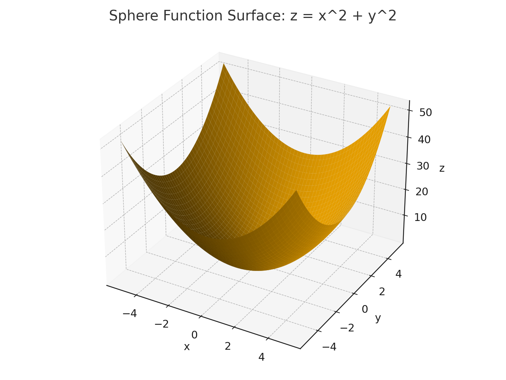
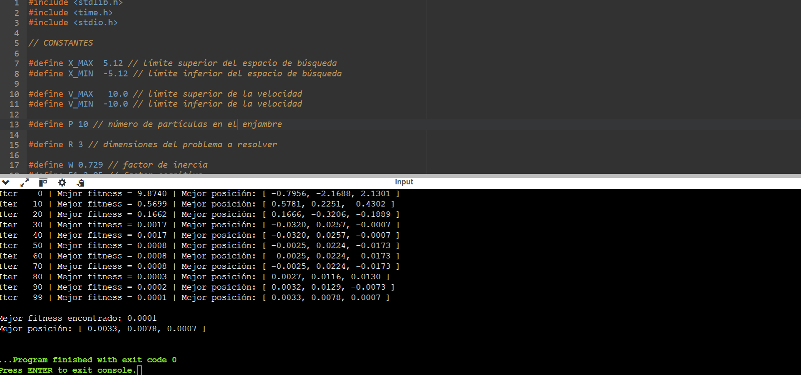

# Sphere benchmark: background, settings, and visuals

This note explains the **Sphere** objective used in the repository example and provides quick,
practical guidance (bounds and parameters), plus visuals.

> **GitHub math tip:** use `$...$` for inline math and `$$...$$` for display equations.
> Make sure this file is **not** inside a code block (no triple backticks around the whole text).

## What is the Sphere function?
The Sphere function in $\mathbb{R}^d$ is defined as:
$$
\operatorname{Sphere}(\mathbf{x}) = \sum_{i=1}^{d} x_i^2
$$
It is **convex**, **separable**, and **strictly unimodal** with a unique global minimum at
$\mathbf{x}^* = \mathbf{0}$ where $f(\mathbf{x}^*) = 0$. Because of its smooth, bowl-shaped
landscape, it is commonly used to **sanity-check** the behavior of optimizers such as PSO.

**Why Sphere is useful here**
- Ensures the implementation moves downhill consistently.
- Highlights how **personal bests** and the **global best** guide the swarm.
- Shows typical PSO behavior: quick coarse approach to the basin, then fine convergence near the origin.

## Recommended bounds and defaults
- **Position bounds** (example): `X_MIN = -5.12`, `X_MAX = 5.12`
- **Velocity bounds** (example): `V_MIN = -10`, `V_MAX = 10`
- **Swarm size**: `P = 10`–`30` for low dimensions (e.g., `d=3`); higher for larger `d`
- **Iterations**: `100`–`500` for quick tests
- **Topology**: global-best
- **Heuristics**: consider decreasing inertia `w` over time (exploration → exploitation)

> For higher dimensions (e.g., $d=10$), increase `P` and `max_iter` to maintain reliable convergence.

## Visuals
Add these to your README or keep them here for reference.

- 3D surface (2D slice of Sphere):  
  

- 2D contour view:  
  

## Results (run interpretation)

Below is an example run you shared (see image). The swarm converges from an initial best fitness of
~**9.8740** at iteration 0 toward a final best fitness of ~**0.0001** by iteration 99, with the best
position approaching the origin (e.g., $[0.0033,\ 0.0078,\ 0.0007]$). This is the expected behavior
on Sphere: the global best quickly finds the basin around $\mathbf{0}$ and subsequent updates
produce small, steady improvements.

- **Early iterations (0–20):** the global best changes rapidly as particles sample the space.
- **Middle (20–70):** the global best stabilizes near the basin; best fitness drops by orders of magnitude.
- **Late (70–99):** particles exhibit small oscillations around the nearly optimal region; improvements become marginal.

**The result obtained is shown below:**  

### What to look for in future runs
- A monotonic (or near-monotonic) decline in **best fitness**.
- **Best position** close to the zero vector.
- Stable behavior (no exploding velocities); otherwise adjust bounds or the inertia schedule.

_Last updated: 2025-11-07_
